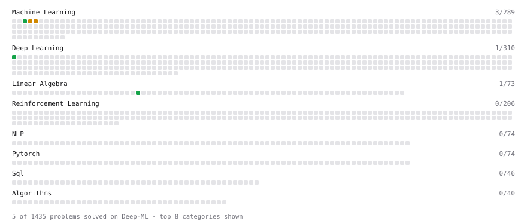

# Deep-ML

My machine learning practice from [Deep-ML](https://www.deep-ml.com). Every solution here was written by hand.

**3** solved · 3 problems · 0 labs · 0 math

[**Browse the interactive portfolio**](https://jsaumil.github.io/deep-ml/) to replay this filling in over time.

## Problems

| | Difficulty | Solved | |
| --- | --- | --- | --- |
| [Feature Scaling Implementation](https://www.deep-ml.com/problems/16) | easy | 2026-09-22 | [solution](problems/0016-feature-scaling-implementation) |
| [Implement Compressed Column Sparse Matrix Format (CSC)](https://www.deep-ml.com/problems/67) | easy | 2026-09-23 | [solution](problems/0067-implement-compressed-column-sparse-matrix-format-csc) |
| [K-Means Clustering](https://www.deep-ml.com/problems/17) | medium | 2026-09-22 | [solution](problems/0017-k-means-clustering) |

---

_This file is regenerated by Deep-ML on every push._
